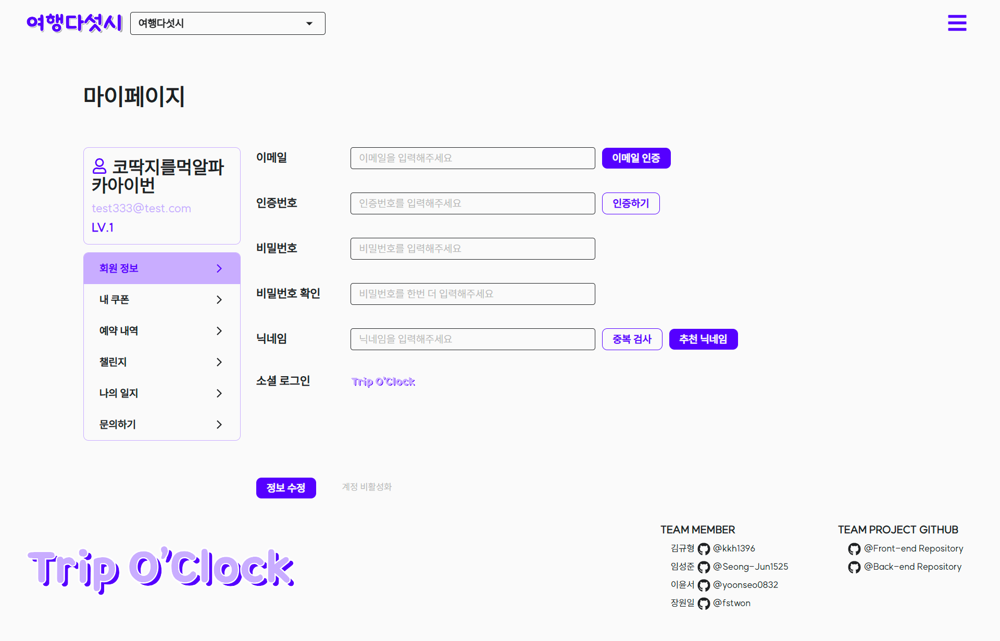
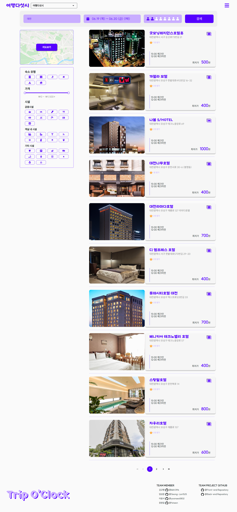

# ✈️ 여행 다섯시 FE 프로젝트

## 📘 프로젝트 소개

### 📌 개요

- `공공데이터`를 활용한 웹 서비스 개발
- 기획, 설계, 개발 단계를 거쳐 `실무에 가까운 팀 프로젝트 경험`

### 🎯 목표

- `숙박 예약 시스템을 개발`
- `사용자 문의 시스템을 개발`
- 프론트엔드 상태 관리와 Atomic Design Pattern 구조 설계 학습
- 백엔드 MVC Design Pattern 구조 설계 학습

## 🚀 주요기능

|    분류     | 기능                                                                                                                                                                    |
| :---------: | :---------------------------------------------------------------------------------------------------------------------------------------------------------------------- |
|  👤 사용자  | - 회원가입 및 로그인  - 사용자 문의 시스템(1:1 채팅 기능)  - 다이어리, 레벨/쿠폰 - 비회원 예약 조회 - 관리자 기능(숙박/객실, 예약, 문의 관리)           |
|   🨠숙박   | - 숙박업소 및 객실 등ë¡/수정/ì‚­ì œ,Â ì²¨ë¶€íŒŒì¼ ê¸°ëŠ¥ - 지도 API를 활용한 숙박 ëª©ë¡ ì¡°íšŒ - 숙박업소 공공데이터 가공 및 객실 ë°ì´í„° ìƒì„± - 예약/결제 및 ì·¨ì†Œ  |
| ╠부가기능 | - 장바구니 - ì´ìš©í›„기/í‰ì  등ë¡ - 챌린지 기능                                                                                                                   |

## 팀원 소개

<table>
  <thead>
    <tr>
      <th colspan="4" style="font-size: 20px; text-align: center; padding: 10px;">여행 다섯시</th>
    </tr>
  </thead>
  <tbody>
    <tr>
      <td colspan="2" align="center" style="font-size: 16px; text-align: center; padding: 10px;">회원 팀</td>
      <td colspan="2" align="center">숙박 팀</td>
    </tr>
    <tr>
      <td align="center"><a href="https://github.com/kkh1396">👩‍💻 김규형</a></td>
      <td align="center"><a href="https://github.com/fstwon">👩‍💻 장원일</a></td>
      <td align="center"><a href="https://github.com/Seong-Jun1525">👩‍💻 임성준</a></td>
      <td align="center"><a href="https://github.com/yoonseo0832">👩‍💻 이윤서</a></td>
    </tr>
    <tr>
      <td align="center">👨‍💼 팀장 📅 일정/이슈관리</td>
      <td align="center">🧩 화면기획 🖥️ FE 관리</td>
      <td align="center">🧠 서비스기획 🗃️ 형상/DB/BE 관리</td>
      <td align="center">🨠UI/UX ë””ìì´ë„ˆ 📅 일정/이슈관리</td>
    </tr>
    <!-- <tr>
      <td colspan="4" align="center">문서작업</td>
    </tr>
    <tr>
      <td>기능상세정의서 발표자료 작업</td>
      <td>화면설계서 FE 프로젝트 설정 문서 FE 코딩 컨벤션</td>
      <td>유사프로그램분석 / 기능도출문서 Git 가이드 문서 및 기능정의서 테이블설계서 / ERD BE 프로젝트 설정 문서</td>
      <td>BE 코딩 컨벤션 문서 화면설계서 기능상세정의서</td>
    </tr> -->
  </tbody>
</table>

## 🖌️ 화면 설계서

### 👩‍💻 담당자 : [장원일](https://github.com/fstwon), [이윤서](https://github.com/yoonseo0832)

📎 Figma : [화면설계서 링크](https://www.figma.com/design/4VmjirzkG9ZLmEiM3Dytbq/KH_Final_TripO-clock?node-id=99-131&p=f&t=sfo88oW6qY31rGID-0)

## 🗂️ ERD

### 👩‍💻 담당자 : [임성준](https://github.com/Seong-Jun1525)

## 🖼️ 대표사진

  
<strong>🌇 메인페이지 & 테마</strong>

#### 메인 테마

#### 봄 테마

#### 여름 테마

#### 가을 테마

#### 겨울 테마

  
<strong>👤 회원</strong>

#### 로그인

#### 회원가입 - 이메일

#### 회원정보 수정

#### 예약내역

#### 챌린지

  
<strong>💬 채팅</strong>

#### 채팅 문의

#### 채팅

  
<strong>🨠숙박</strong>

#### 숙박 목록

#### 숙박목록 지도

#### 숙박 상세

  
<strong>🧾 예약 / 결제</strong>

#### 장바구니

#### 예약

#### 결제

#### 영수증

  
<strong>🛠️ 관리자</strong>

#### 관리자 화면

## 🛠️ 기술 스택

### 💻 Language & Framework & Library

### 🧠 State Management

### 🗄️ Database & ORM

### 🎨 Style

### 🔌 API

### 🧰 IDE

## 🔗 관련 저장소

[BE Project Repository](https://github.com/TEAM-PROJECT-ACC/trip-at-five-server)
